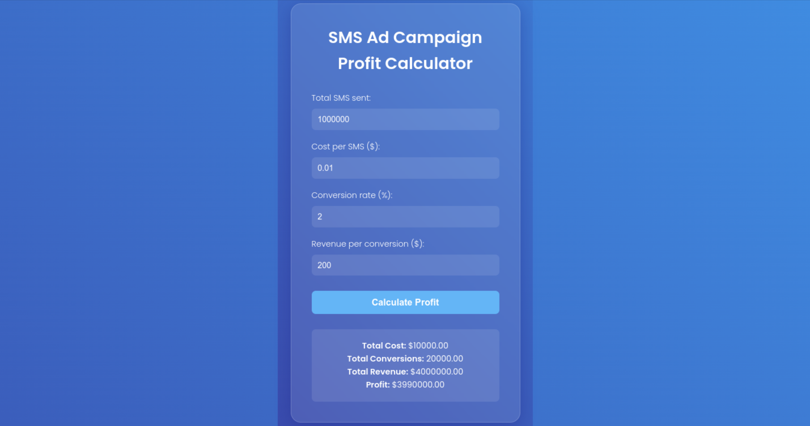

# SMS Ad Campaign Profit Calculator

This project is a modern, responsive web application that calculates the profit of an SMS ad campaign. It features a sleek user interface with glassmorphism effects, smooth animations, and an engaging blue gradient background.

## Features

- Calculate profit based on campaign parameters
- Responsive design that works on desktop and mobile devices
- Modern UI with glassmorphism effects
- Animated gradient background
- Smooth transitions and animations

## Live Demo

[View Live Demo](https://yourusername.github.io/sms-ad-campaign-calculator) <!-- Replace with your actual GitHub Pages URL -->

## Screenshot

 <!-- Add a screenshot of your application here -->

## Installation

1. Clone the repository:
   ```
   git clone https://github.com/yourusername/sms-ad-campaign-calculator.git
   ```
2. Navigate to the project directory:
   ```
   cd sms-ad-campaign-calculator
   ```
3. Open `index.html` in your web browser.

## Usage

1. Enter the following campaign details:
   - Total SMS sent
   - Cost per SMS ($)
   - Conversion rate (%)
   - Revenue per conversion ($)
2. Click the "Calculate Profit" button.
3. View the results, including total cost, total conversions, total revenue, and profit.

## Technologies Used

- HTML5
- CSS3
- JavaScript

## Contributing

Contributions are welcome! Please feel free to submit a Pull Request.

## License

This project is open source and available under the [MIT License](LICENSE).
